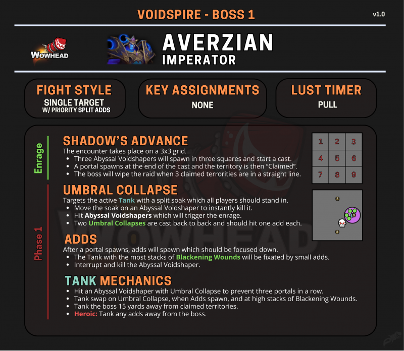

# 元首阿福扎恩

> **副本**: 虚空尖塔
> **英文名**: Imperator Averzian
> **备注**: 副本开门首领

> 来源: Wowhead Midnight Season 1 Raid Cheat Sheet / B站攻略

---

## 攻略速查图

> **原图链接**: https://wow.zamimg.com/uploads/screenshots/normal/1277139.png?maxWidth=800

---

## 战斗信息

| 项目 | 说明 |
|------|------|
| **战斗类型** | 单体目标 + 优先击杀小怪 |
| **关键分配** | 无 |
| **嗜血时机** | 开怪 |

---

## 核心思路

**阻止 BOSS 完全占领三块场地，导致团灭。**

BOSS 每次召唤三只大怪，若不处理掉其中两只，会在随后连续补齐，横竖斜连成一线，占领三块场地，直接团灭。

所有大怪出现时都在读条准备变为实体，且大怪满能量成型为实体后，还有个需要打断的读条技（英雄难度应该还好）。

---

## 阶段机制

### 暗影进军 (SHADOW'S ADVANCE) - 占领场地

战斗在一个 **3x3 的网格**上进行。

- 三个深渊虚空塑形者会在三个格子中生成并开始施法
- 施法结束后会生成一个传送门，该区域被"占领"
- 当三个被占领的区域连成一条直线时（横/竖/斜），Boss 会团灭团队

### 幽影塌缩 (UMBRAL COLLAPSE) - 只点坦克，分担圈

玩家需要利用 "幽影塌缩" 分担圈，阻止大怪成型，完成一块场地的占领。

- **只点坦克**，是分担圈，需要全团帮忙分担
- 坦克移动到大怪旁边，用分担圈炸掉大怪
- 击中深渊虚空塑形者可以瞬间击杀它，但会触发激怒
- 两次幽影塌缩会连续施放，每次应该击中一个小怪

### 占领场地技能

- BOSS 随机一块区域丢出一只大怪造成范围 AOE，躲开
- 被占领的场地周围，会出现无数小怪，拉住转火 A 掉
- 小怪残血时，会爬向被 BOSS 占领的场地回血，记得减速 A 掉
- 有一只小怪会举盾给其他小怪减伤，记得换个方向打断 A 掉或者拉开

### 小怪 (ADDS)

传送门生成后，会出现需要优先击杀的小怪。

- 身上黑化创伤层数最多的坦克会被小怪 fixate（锁定）
- **小怪靠近Boss会无敌**，需拉开
- 打断并击杀深渊虚空塑形者

---

## 坦克职责

- T 要把 BOSS 拉走，别站在被占领的场地附近
- 用幽影塌缩击中深渊虚空塑形者，防止三个传送门连成一线
- 在幽影塌缩、小怪出现、以及黑化创伤层数高时换坦
- **英雄模式**: 将小怪拉离 Boss
- 小怪和 BOSS 分开拉，双 T 在小怪与 BOSS 之间来回换嘲
- 打 T 技能叠层，5~6 层一换嘲（降低生命上限）

---

---

## 关键技能

| 技能名 | 描述 | 应对 |
|--------|------|------|
| 暗影进军 | 3x3网格机制，三连占领即灭团 | 控制传送门位置，防止连成直线 |
| 幽影塌缩 | 分摊伤害圈 | 移动到小怪身上秒杀 |
| 黑化创伤 | 坦克叠加的debuff，小怪追层数高的T | 5~6层换坦 |
| 占领场地 | 大怪占领格子 | 用分担圈炸掉大怪 |

---

## 战斗场地

3x3 网格场地，BOSS 位于中央区域。

> **打完之后**：往前走进门厅，左路去老二，右路去老三，直走出门厅去老四

---

> **史诗难度攻略**: 见 [README-M.md](./README-M.md)
