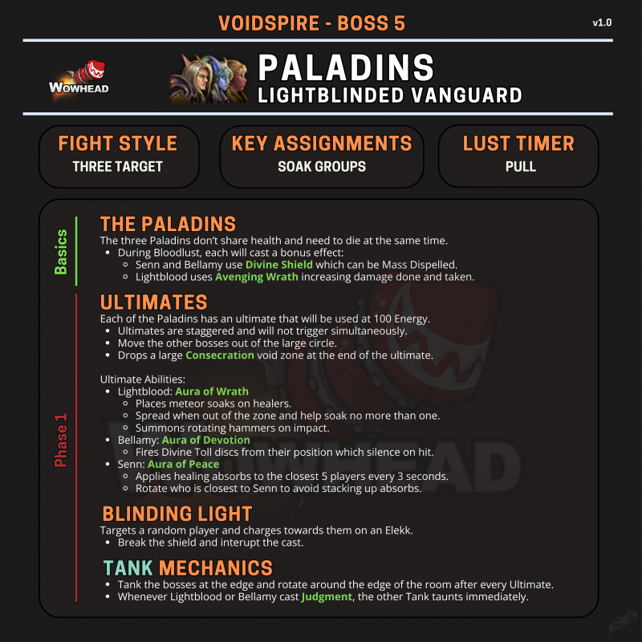

# 光芒先锋军

> **副本**: 虚空尖塔 | **位置**: 5号Boss（守门首领）
> **英文名**: Lightblinded Vanguard
> **战斗类型**: 议会型三目标（血量不共享）

---

## 攻略速查图



---

## 战斗信息

| 项目 | 说明 |
|------|------|
| **战斗类型** | 三目标议会 |
| **关键分配** | 分担组 × 3、沙包组 |
| **嗜血时机** | P3（三目标同时存在且压力最大时） |

---

## 核心思路

**议会型战斗**：三名圣骑士（FQ/CJ/NQ）血量不共享，需尽量同时倒地。

- 任意 BOSS 死亡后，其余 BOSS 增伤 30%
- 满能量释放大招后会留下一大片奉献污染场地
- 场地按顺时针旋转移动，BOSS 释放顺序：**FQ → CJ → NQ**
- 全程有3个 BOSS 的环境 AOE，治疗压力极大

---

## 三名圣骑士

| 简称 | 名称 | 定位 |
|------|------|------|
| **FQ** | 阿米亚斯·贝拉米将军 (General Amyas Bellamy) | 防骑 |
| **CJ** | 指挥官维莱尔光血 (Commander Vailor Lightblood) | 惩戒骑 |
| **NQ** | 战争牧师瑟琳 (War-Priest Senn) | 奶骑 |

---

## 开场与站位

### 坦克拉怪

1. **起手拉边场**：两名坦克（T）分别拉开 FQ 和 CJ
2. **NQ 不需特意拉仇恨**：只需建立初始仇恨即可
3. **换嘲时机**：红色与蓝色审判后进行换嘲

### 站位示意

```
        [分担组1●]  [分担组2◆]  [分担组3■]
              ↑
    [沙包组] ←—— NQ（奶骑）
                  ↙
    FQ ←—— 坦克带位（沿场边逆时针/顺时针移动）——→ CJ
           ↓
      [奉献区域]（顺时针铺开）
```

- **分担组**：标记光柱（圆圈●/大饼◆/方块■），对应 1/2/3 组
- **沙包组**：远程/机动职业在远处"排队"，勾引 NQ 的骑马冲锋

---

## 换 T 机制

| BOSS | 审判颜色 | 换嘲方式 |
|------|----------|----------|
| CJ（惩戒骑） | 🟡 黄审判 | CJ 打主 T → 副 T 换嘲接裁决 |
| FQ（防骑） | 🔵 蓝审判 | FQ 打副 T → 主 T 换嘲接正义盾击 |

⚠️ **如果不换嘲，受到伤害提高 200%**

---

## 防骑 (FQ) 机制

### 满能量技能：虔诚光环 + 直线飞盾

- **虔诚光环**：减伤 40 码附近所有 BOSS
- **直线飞盾**：FQ 原地释放直线飞盾，**注意躲避路径**
- 脚下释放奉献污染区域
- 坦克需带位离开奉献区域

### 常规技能

| 技能 | 效果 | 应对 |
|------|------|------|
| **点名飞盾** | 中招者靠边站位，路径不能站人 | 15秒持续掉血，可驱散 |
| **转转锤** | 沉默 3 秒 | 躲开 |
| **审判** | 🔵 蓝审判 → 主 T 换嘲 | 换嘲 |

---

## 惩戒骑 (CJ) 机制

### 满能量技能：愤怒光环 + 天锤点名

- **愤怒光环**：增伤 40 码附近所有 BOSS
- **天锤点名**：点名 3 人，需看分担位置依次站好
- 分担组 1→2→3 依次进入各自分担圈
- 脚下释放奉献污染区域
- 坦克需带位离开奉献区域

### 常规技能

| 技能 | 效果 | 应对 |
|------|------|------|
| **转转锤** | 分担后出现，伤害极高 | 躲开！ |
| **神圣风暴** | 8 码近战 AOE | 近战躲避 |
| **审判** | 🟡 黄审判 → 副 T 换嘲 | 换嘲 |

⚠️ **分担后 5 秒内不可再分担，分担后立即躲避转转锤**

---

## 奶骑 (NQ) 机制

### 满能量技能：平心光环

- **平心光环**：让攻击者"平静"（无法攻击）
- 点名最近的几个玩家吸收奶盾（可叠加）
- 脚下释放奉献污染区域

### 常规技能

| 技能 | 效果 | 应对 |
|------|------|------|
| **骑马冲锋** | 冲锋最远玩家，路径全员受损 | 沙包组排队勾引，路径清空 |
| **破盾打断** | 到位后需破盾并打断 | 快速转火打盾 |
| **圣光轨道炮** | 区域每秒 13W | 躲开 |

⚠️ **奶骑冲锋路径必须清空，破盾打断要快**

---

## 战斗流程

### P1：开场带位

1. 坦克拉边场，分别拉住 FQ 和 CJ
2. 沙包组就位，勾引 NQ 冲锋
3. 分担组标记好位置

### P2：循环换位

1. 坦克像"拉火车"一样沿场边移动 BOSS
2. 每次满能量大招后，奉献污染场地
3. 按奉献排布方向（顺时针）带位
4. 处理分担、躲转转锤、打断 NQ

### P3：嗜血阶段

- 三目标同时存在且压力最大时开启嗜血
- 注意：嗜血阶段 BOSS 会无敌，需及时驱散
- 保持血量平衡，尽量同时击杀

---

## 关键技能速查

| 技能名 | 描述 | 应对 |
|--------|------|------|
| 虔诚光环 | FQ 满能量，减伤附近 BOSS | 拉走其他 BOSS |
| 愤怒光环 | CJ 满能量，增伤附近 BOSS | 拉走其他 BOSS |
| 平心光环 | NQ 满能量，让攻击者无法攻击 | 停止攻击，等待驱散 |
| 直线飞盾 | FQ 满能量，原地直线飞盾 | 躲避路径 |
| 天锤点名 | CJ 满能量，点名 3 人秒杀 | 分担组 1→2→3 依次分担 |
| 转转锤 | 分担后出现，极高伤害 | 立即躲避 |
| 点名飞盾 | FQ 小技能，点名直线伤害 | 靠边站位，可驱散 |
| 骑马冲锋 | NQ 小技能，冲锋最远玩家 | 沙包组勾引，路径清空 |
| 神圣风暴 | CJ 小技能，8 码近战 AOE | 近战躲避 |

---

## 核心要点总结

| 角色 | 关键任务 |
|------|----------|
| **坦克** | **换坦是核心！** 黄蓝审判后必须换嘲，否则伤害 +200% 直接崩 |
| **分担组** | 123 组分担不能乱，分担后立即躲转转锤 |
| **沙包组** | 排队勾引 NQ 冲锋，确保路径清空 |
| **全员** | 控制 NQ 破盾打断要快，否则治疗压力崩盘 |

---

> **史诗难度攻略**: 见 [README-M.md](./README-M.md)
