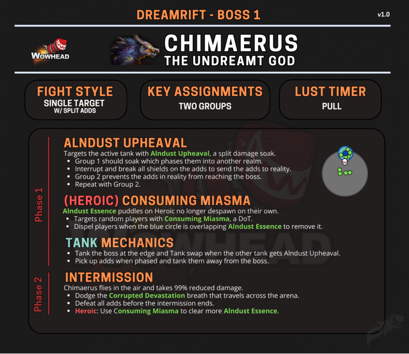

# 奇美鲁斯 (Chimaerus)

> **副本**: 幽梦裂隙 (The Dreamrift)
> **英文名**: Chimaerus
> **备注**: 幽梦裂隙唯一 Boss

> 来源: Wowhead Midnight Season 1 Raid Cheat Sheet / B站攻略

---

## 攻略速查图

> **原图链接**: https://wow.zamimg.com/uploads/screenshots/normal/1277174.png?maxWidth=800

---

## 战斗信息

| 项目 | 说明 |
|------|------|
| **战斗类型** | 内/外场分边 + 空间管理 |
| **关键分配** | 两组轮换（内场/外场） |
| **嗜血时机** | 开怪 |

---

## 核心思路

**分团轮换进内场打盾，外场转火清小怪，白圈点名消水。**

BOSS 原地吼叫后满场出现大中小各类小怪。团队分为两组，依次吃 BOSS 头前分担进入内场（40秒），打破小怪护盾后送回外场，外场负责击杀。小怪若未被击杀，BOSS 飞天会吃掉回血增伤。

---

## P1 阶段

### 分组与内场机制

- **全团分为两组**，每组最好配备 DK（用于拉怪）
- 一组留在场外，一组在 **蓝色方块** 集合分担进入内场
- 两组轮换进入

### 内场任务 (40秒)

1. 进入后 **第一时间击破小怪盾**
2. 尽量在 **蓝方块附近击杀**，让污染（金水）相对集中，方便后续消水
3. 打完小怪后再转火 BOSS

### 外场任务

- 内场小怪破盾后会出场走向 BOSS，**第一时间转火打掉**
- 小怪吃控制，T 需根据大怪刷新位置调整站位
- DK 拉怪、减速击杀

### 白圈点名 (消水)

- 被点名白圈的玩家需 **离开人群，寻找金水最多的地方**
- 站定后由奶妈驱散，**切记不能秒驱**（需等玩家到位）
- 驱散后炸掉金水，清场

### 如果小怪没杀完

- BOSS 满能量会飞天，俯冲下地 AOE 全团
- 吃掉所有小怪给自己回血增伤
- 可能会周期性给全团上治疗吸收盾

---

## P2 阶段转换

- **两次进内场后转入 P2**
- 大饼集合引导龙喷，随后集体移动到三角
- 龙喷会留下直线污染和小怪，需集合处理

---

## P2 阶段

- BOSS 飞到台子上（无敌）
- 召唤一大片小怪
- 满场都是水

### 核心策略

1. 大团转火小怪
2. 尽可能在 BOSS 准备俯冲下地之前清干净小怪
3. 同样会点名数个玩家魔法 DoT，驱散后消水
4. **水消的越多，身上 DoT 越疼，击退距离越大**

---

## 治疗压力

- **25秒/次** 的全团环境 AOE
- 附带 **12秒** 后续掉血
- 奶妈压力极大

---

## 场地站位标注

| 标记 | 位置 | 用途 |
|------|------|------|
| **蓝色方块** | 场中央 | 分担进内场集合点、内场小怪集合点 |
| **黄色/白色圆圈** | 指定区域 | 点名消水白圈、内场怪破盾出的金水区域 |
| **橙色大饼** | P2 起点 | P2 阶段起始的集合引喷点 |
| **绿色三角** | P2 目标 | P2 阶段引完喷吐后的集体移动目标点 |
| **紫色骷髅** | - | 大怪标记 |
| **月亮** | - | 中怪标记，需打断 |
| **绿色十字** | - | 大怪 AOE，优先级最高 |

### 坦克带位

- T 带位时，大怪可根据方向拉向紫菱或月亮标记

---

## 坦克职责

- 将 Boss 坦克在边缘
- 当另一名坦克获得艾兰之尘时换坦
- 相位时拉住小怪，将它们坦克在远离 Boss 的位置
- 根据大怪刷新位置调整站位

---

## 关键技能

| 技能名 | 描述 | 应对 |
|--------|------|------|
| 艾兰之尘 (Upheaval) | 分坦分摊，进内场 | 两组轮流分摊 |
| 内场小怪 | 20W 护盾 | 打断护盾，击杀 |
| 外场小怪 | 从内场出来 | 减速并击杀 |
| 吞噬瘴气 (Consuming Miasma) | 英雄 DoT | 站金水处驱散清除水坑 |
| 金水 | 踩上有伤害 | 驱散消水 |
| 腐蚀毁灭 | 过渡吐息 | 躲避 |
| BOSS 飞天 | 吃小怪回血 | 尽快清小怪 |

---

## 开荒核心重点

| 重点 | 说明 |
|------|------|
| **轮换节奏** | P1 两组人必须进出场有序，内场打盾速度决定外场压力 |
| **消水管理** | 点名白圈玩家必须精准覆盖地上的金水，到位后驱散清场 |
| **P2 位移** | 大团必须步调一致（大饼 → 三角），避免被龙喷封死走位空间 |

---

## 战斗循环

P1 ~ P2 轮番循环

---

## 战斗场地

中央平台 + 周围区域（内场），满地金水需要注意。

---

> **史诗难度攻略**: 见 [README-M.md](./README-M.md)
