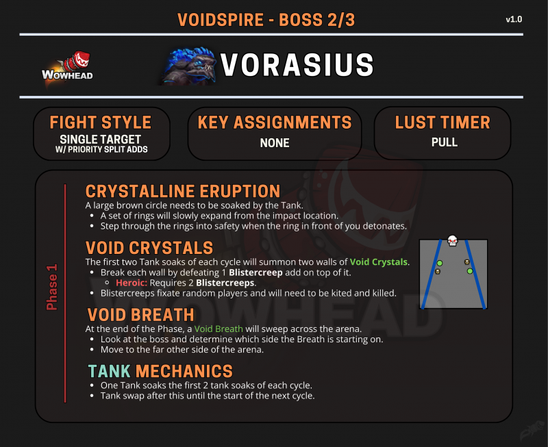

# 弗拉希乌斯

> **副本**: 虚空尖塔
> **英文名**: Vorasius
> **备注**: 巨型深渊掠食者

> 来源: Wowhead Midnight Season 1 Raid Cheat Sheet / B站攻略

---

## 攻略速查图

> **原图链接**: https://wow.zamimg.com/uploads/screenshots/normal/1277140.png?maxWidth=800

---

## 战斗信息

| 项目 | 说明 |
|------|------|
| **战斗类型** | 单体目标 + 优先击杀小怪 |
| **关键分配** | 无 |
| **嗜血时机** | 开怪 |

---

## 核心思路

**摧毁两侧水晶墙后，站到 BOSS 嘴两侧安全位置躲避横扫吐息。**

场地左右两侧各有一排水晶墙，BOSS 吐息横扫全场之前，BOSS 会召唤一大片小怪，小怪自爆附带 AOE 外加摧毁水晶墙。两侧水晶墙被摧毁后，才可以让大团安全的跑到最左边最右边位置，躲开横扫吐息。

---

## 阶段 1 机制

### 晶体喷发 (CRYSTALLINE ERUPTION)

一个大型棕色圈需要坦克去踩（分摊）。

- 一圈环形波纹会从落点慢慢向外扩散
- 当面前的波纹爆炸时，跨过波纹进入安全区
- 水晶墙是由 BOSS 打 T 的砸地板之后出现的

### 虚空水晶 (VOID CRYSTALS)

每个循环的前两次坦克分摊会召唤两堵虚空水晶墙。

- 在每堵墙上击杀 1 只 Blistereep 小怪来打破墙
- **英雄模式**: 需要 2 只 Blistereep
- Blistereep 会锁定随机玩家，需要风筝并击杀

### 虚空吐息 (VOID BREATH)

在阶段结束时，一道虚空吐息会横扫整个场地。

- BOSS 满能量大招，吐息横扫全场
- 观察 Boss 确定吐息从哪一边开始
- 大团摧毁两侧墙壁后，站到嘴两侧安全位置
- 移动到场地的另一边

---

## 坦克职责

- 一名坦克负责每个循环的前两次分摊
- 在此之后换坦，直到下一个循环开始
- **断桥 BOSS 机制**：原地砸地板，T 去接砸地板伤害，之后 T 易伤，一层一换 T
- **马桶战**：T 不要离开近战位

---

## 其他技能

- 群体拉人 + 击退

---

## 关键技能

| 技能名 | 描述 | 应对 |
|--------|------|------|
| 晶体喷发 | 大型分摊圈 + 扩散波纹 | 坦克踩圈，穿过爆炸波纹 |
| 虚空水晶 | 召唤水晶墙 | 在墙上击杀 Blistereep |
| 虚空吐息 | 横扫全场的吐息 | 摧毁墙壁后站到两侧安全区 |
| 砸地板 | 坦克分摊 + 易伤 | 一层一换 T |
| 群体拉人+击退 | 小技能 | 正常应对 |

---

## 战斗场地

长条形场地，左右两侧有水晶墙。

---

> **史诗难度攻略**: 见 [README-M.md](./README-M.md)
