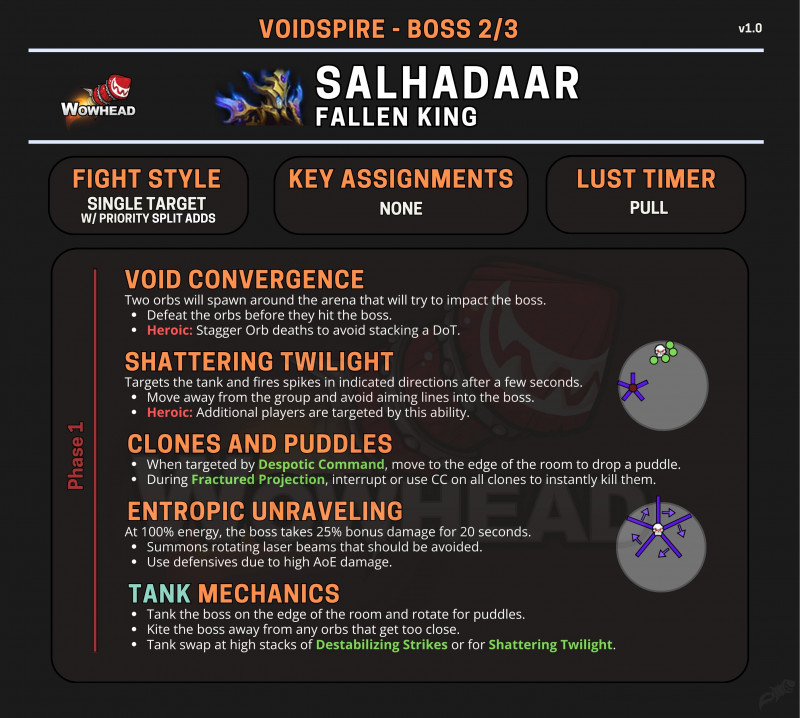

# 堕落之王萨尔哈达尔 (陨落之王萨哈达尔)

> **副本**: 虚空尖塔
> **英文名**: Fallen-King Salhadaar
> **备注**: 曾出现在 11.2 版本的剧情人物

> 来源: Wowhead Midnight Season 1 Raid Cheat Sheet / B站攻略

---

## 攻略速查图

> **原图链接**: https://wow.zamimg.com/uploads/screenshots/normal/1277149.jpg?maxWidth=800

---

## 战斗信息

| 项目 | 说明 |
|------|------|
| **战斗类型** | 单体目标 + 优先击杀小怪 |
| **关键分配** | 无 |
| **嗜血时机** | 开怪 |

---

## 核心思路

**阻止 BOSS 吃黑洞，否则团灭，转火打黑洞。**

BOSS 每波召唤两颗黑洞，黑洞缓慢爬向 BOSS，如果黑洞被 BOSS 吃掉，则团灭。DPS 需要转火打掉黑洞。

---

## 阶段 1 机制

### 虚空汇聚 / 黑洞 (VOID CONVERGENCE)

场地周围会生成两个球，试图撞击 Boss。

- 在球撞击 Boss 前击杀它们
- **英雄模式**: 错开球的死亡时间，避免叠加 DoT
- 黑洞被打掉后，全团掉血 dot，可叠加（黑洞可能需要控制击杀的速度）

### 熵能解构 (ENTROPIC UNRAVELING)

BOSS 积攒能量，满能量时：

- 全屏 AOE 激光横扫，奶妈刷团血
- 之后能量清空，场上出现一片紫水
- Boss 受到 **25% 额外伤害**，持续 20 秒
- 召唤旋转激光束，需要躲避（满场激光，大团躲避球）
- 由于高 AoE 伤害，使用减伤技能
- **紫水会越来越多，场地缩小**（包括点名玩家驱散的放水）

### 破碎暮光 (SHATTERING TWILIGHT) - 尖刺

锁定坦克，几秒后向指示方向发射尖刺。

- 远离团队，避免将射线指向 Boss
- 点 T 出人群，远离大团放尖刺（法力熔炉 7 号那个环状向外扩散的尖刺）
- **英雄模式**: 额外玩家也会被此技能锁定
- **H+难度**: 点 T 出人群放尖刺时，可能会波及更多人，需要出人群放尖刺的人可能更多

### 暴君命令 / 分身和水坑 (CLONES AND PUDDLES)

被暴君命令 (Despotic Command) 锁定时，移动到场地边缘放置水坑。

- 点名数个玩家出人群散开（集合且分散的都靠墙站放水）
- 奶妈可驱散被点名的那几个人，驱散后，刷掉吸收盾（专制指令）
- 在破碎投影 (Fractured Projection) 期间，打断或控制所有分身可以瞬间击杀它们

### 召唤影子

- BOSS 召唤数个影子，需要打断
- 每个影子的每次成功读条，都会在场上召唤一大片紫水
- 需要迅速打断

---

## 坦克职责

- 将 Boss 坦克在场地边缘，为水坑旋转
- 将 Boss 风筝离开任何太靠近的球
- 在动荡打击 (Destabilizing Strikes) 层数高时或破碎暮光时换坦
- 两个 T 随缘换嘲（英雄难度）
- 随缘换嘲（叠层 dot 而已）

---

## 全团职责

- DPS 转火打掉黑洞
- 躲避满能量时的激光
- 被点名时靠墙站放水

---

## 关键技能

| 技能名 | 描述 | 应对 |
|--------|------|------|
| 虚空汇聚/黑洞 | 两个球试图撞击 Boss | 击杀球，控制击杀速度 |
| 熵能解构 | Boss +25% 受伤，全屏激光 | 躲避激光，开爆发 |
| 破碎暮光 | 向方向发射尖刺 | 远离团队，不指向Boss |
| 暴君命令 | 放置水坑 | 移动到边缘 |
| 破碎投影 | 召唤分身 | 打断/控制所有分身 |
| 召唤影子 | 需要打断 | 迅速打断 |

---

## 战斗场地

圆形场地，紫水会逐渐增多缩小战斗区域。

---

> **史诗难度攻略**: 见 [README-M.md](./README-M.md)
