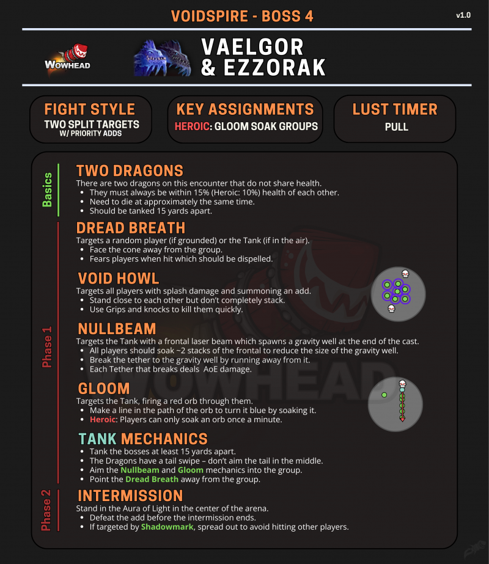

# 威厄高尔和艾佐拉克 (暮光双龙)

> **副本**: 虚空尖塔
> **英文名**: Vaelgor & Ezzorak
> **备注**: 双龙议会型 Boss

> 来源: Wowhead Midnight Season 1 Raid Cheat Sheet / B站攻略

---

## 攻略速查图

> **原图链接**: https://wow.zamimg.com/uploads/screenshots/normal/1277142.png?maxWidth=800

---

## 战斗信息

| 项目 | 说明 |
|------|------|
| **战斗类型** | 两个分割目标 + 优先击杀小怪 |
| **关键分配** | 英雄模式：幽暗分摊组 |
| **嗜血时机** | 开怪 |

---

## 核心思路

双龙不共享血量，需要保持血量接近同时击杀。满能量转阶段时，双龙飞天，全屏 AOE，大团需要进入护盾抵挡伤害。

---

## 基础机制

### 双龙 (TWO DRAGONS)

场上有两条不共享血量的龙。

- 它们的血量必须始终保持在 15% 以内（英雄模式：10%）
- 需要大约同时死亡
- 应该被坦克在相距 15 码的位置
- **龙有扫尾——不要把尾巴朝向中间**

---

## 转阶段机制

### 双龙飞天

- 满能量转阶段时，双龙飞天，全屏 AOE
- 大团需要进入 **NPC 护盾** 抵挡伤害
- NPC 祝福 20 码所有玩家，给一个 30W 吸收罩子，且抵抗减速效果
- 用来抵挡每次 BOSS 转阶段飞天后全屏吐息
- **H 难度下**: 在罩子里刷血时会有影子干扰玩家，在罩子里集合且分散
- 转阶段结束后双龙切换模式进阶段

---

## 威厄高尔 (Vaelgor) 技能

### 技能一：恐惧吐息 (DREAD BREATH)

- 随机点名，头前喷吐
- 被命中的人 **恐惧 15 秒钟**
- 附带高伤掉血，可驱散
- 中点名出大团调整 boss 头朝向

### 技能二：虚空光束 / 大黑圈 (NULLBEAM)

- BOSS **头前** 朝向 AOE 吐息
- 吐息结束，BOSS 面朝方向召唤一个大黑圈
- 短暂延迟后开始捆绑附近的玩家
- 被捆绑的人需要往外跑拉断连线
- **英雄难度下**: 拉断连线后，所有人 5 码散开
- **注意**: 如果大黑圈没有捆绑任何人，则全屏高额 AOE 至团灭

### 技能三：打主 T

- 一种高额混伤伤害
- 之后 T 受到此技能易伤 30%（debuff）
- 易伤可叠加，换嘲即可

---

## 艾佐拉克 (Ezzorak) 技能

### 技能一：虚空嚎叫 / 点名虚空圈 (VOID HOWL)

- 点名数个玩家虚空圈
- 被点名的人，集合且分散，把所有圈放在一起
- 出虚空球转火（转火打掉所有虚空球，记得打断）
- 站得靠近但不要完全重叠
- 使用拉人和击退技能快速击杀小怪

### 技能二：大虚空球

- BOSS **头前** 朝向 AOE 吐息，召唤一颗大虚空球
- 球移动方向是 BOSS 的头前方向
- 玩家需要 **踩球吸球**，让球越来越小
- 最后虚空球移动终点爆炸，在地面上形成一滩黑水
- 黑水大小取决于大虚空球爆炸前的大小

### 技能三：打副 T

- 另一种混伤伤害
- 之后 T 受到此技能易伤 30%（另一种 debuff）
- 易伤可叠加，换嘲即可

---

## 萨拉塔斯技能

- 萨拉塔斯出现，点名一个/数个玩家
- 附给其一个可叠加的 dot
- 随后退场
- 奶妈注意加血

---

## 换 T 机制

- 双 T 各自吃到易伤后，换嘲即可
- debuff 时间 30 秒
- 视 BOSS 打 T 频率而决定几层换嘲，暂定一层换嘲

---

## 双龙残血阶段

- 双龙残血后，都会下地
- 与团队展开战斗
- 此时 T 的换嘲和拉 BOSS 的位置尤为重要

---

## 坦克职责

- 将两条龙坦克在至少 15 码外
- 龙有尾扫——不要把尾巴朝向中间
- 将虚空光束和幽暗机制面向中间
- 将恐惧吐息面向远离团队
- 一层换嘲

---

## 关键技能

| 技能名 | 描述 | 应对 |
|--------|------|------|
| 恐惧吐息 | 锥形恐惧 15 秒 | 面向远离团队，驱散 |
| 虚空光束/大黑圈 | 前方激光 + 重力井捆绑 | 拉断连线，5码散开 |
| 虚空嚎叫 | 溅射伤害 + 小怪 | 靠近但不重叠，转火球 |
| 大虚空球 | 需要踩球吸收 | 踩球减小体积 |
| 暗影印记 | 过渡期点名 | 分散 |
| 萨拉塔斯 dot | 可叠加 dot | 奶妈加血 |

---

## 战斗场地

长条形场地，双龙分列两端。

> **之后上楼梯直走，别跳漩涡，在路的尽头，是老五**

---

> **史诗难度攻略**: 见 [README-M.md](./README-M.md)
